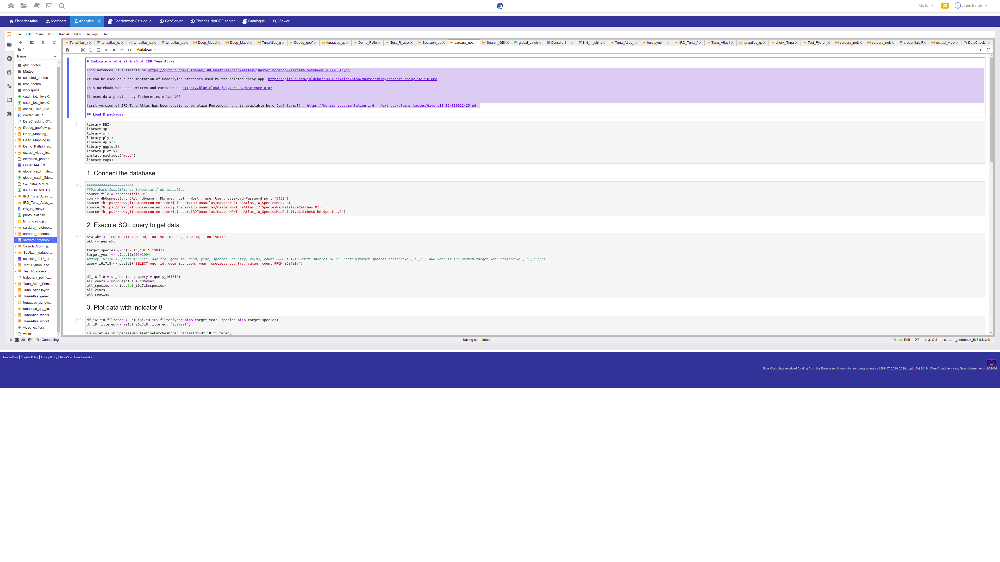
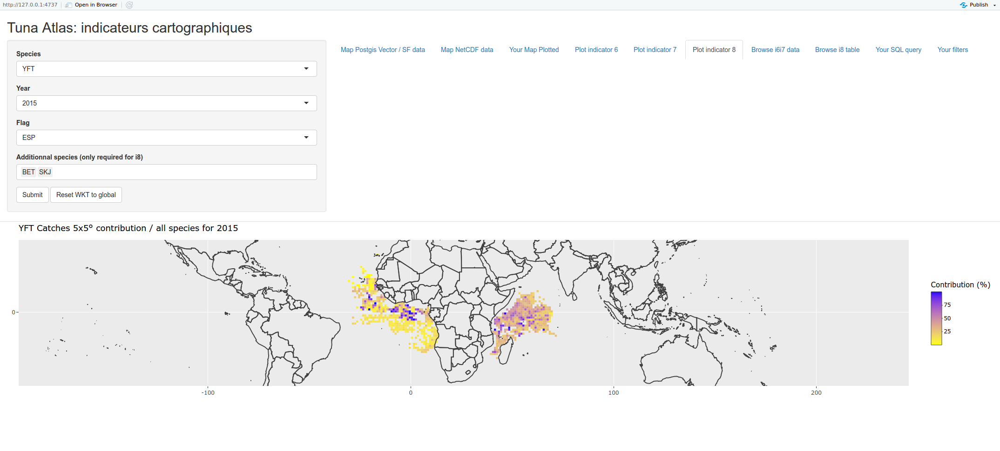

IRD / UMR EME Tuna Atlas: set of generic indicators for Fisheries datasets

---
# Indicators for Fisheries: use case of the Tuna Atlas

See documentation : https://github.com/jsubei/IRDTunaAtlas/wiki

## Tuna Atlas interactive maps and charts

This github page contains the code which:
 - extracts input data from the [Tuna Atlas](https://) developed jointly by IRD & FAO,
 - transforms input data to generates maps and plots: R functions or scripts,
 - packages maps and charts within either dynamic reports, shiny apps, jupyter notebooks...

Input data are obtained from a spatial data infrastructure currently hosted within the [Fisheries Atlas VRE](https://blue-cloud.d4science.org/) of the [Blue Cloud H2020 project](https://www.blue-cloud.org/).

## Analysis code

Key elements of the analysis code are a set of indicators originally drafted by Alain Fontenau which were written in R by Norbert Billet and Julien Barde during iMarine FP7 project:
- *[Indicator I1 : Annual catches by ocean](https://github.com/jsubei/IRDTunaAtlas/wiki/Indicator-I1-%3A-Annual-catches-by-ocean)* – an R script that extracts and reformats time-series stored within a Potgres/Postgis database. The output files are saved in the *outputs/www/html/tmp* folder.
- *[Indicator I2 : Annual catches by gear](https://github.com/jsubei/IRDTunaAtlas/wiki/Indicator-I2-:-Annual-catches-by-gear)*
- *[Indicator I3 : Catches by gear and by month](https://github.com/jsubei/IRDTunaAtlas/wiki/Indicator-I3-:-Catches-by-gear-and-by-month)*
- *[Indicator I4 : Catches by month and by ocean](https://github.com/jsubei/IRDTunaAtlas/wiki/Indicator-I4-:-Catches-by-month-and-by-ocean)*
- *[Indicator I6 : Catches by 5x5 degrees](https://github.com/jsubei/IRDTunaAtlas/wiki/Indicator-I6-:-Catches-by-5x5-degrees)*
- *[Indicator I7 : 5x5 degrees relative contribution to catches](https://github.com/jsubei/IRDTunaAtlas/wiki/Indicator-I7-:-5x5-degrees-relative-contribution-to-catches)*
- *[Indicator I8 : Catches relative contribution over other species](https://github.com/jsubei/IRDTunaAtlas/wiki/Indicator-I8-:-Catches-relative-contribution-over-other-species)*
- *[Indicator I9 : Size frequencies by school type](https://github.com/jsubei/IRDTunaAtlas/wiki/Indicator-I9-:-Size-frequencies-by-school-type)*
- *[Indicator I10 : Size frequencies by decade](https://github.com/jsubei/IRDTunaAtlas/wiki/Indicator-I10-:-Size-frequencies-by-decade)*
- *[Indicator I11 : Catches by country](https://github.com/jsubei/IRDTunaAtlas/wiki/Indicator-I11-:-Catches-by-country)*

An example of function outputs is provided below (eg Indicator I3 : Catches by gear and by month):

Some of the SQL queries used to extract data are also shared in this github repository.

## Jupyter notebooks

Jupyter notebooks have been set up to help newcomers execute and customize the analysis code. The jupyter notebooks are meant to help users making use of previous R analysis code.

These notebooks are available on this github repo [eg Jupyter notebook example for indicators i6, i7 and i8](https://github.com/juldebar/IRDTunaAtlas/blob/master/jupyter_notebook/sardara_notebook_i6i7i8.ipynb)
and have been developped and executed in the [Fisheries Atlas VRE](https://blue-cloud.d4science.org/) which contains a JupyterHub server. A screenshot of a Jupyter notebook is provided below.

## Shiny apps

Shiny apps  have been set up to help newcomers to explore easily the data by using the set of indicators generated by analysis code. Users of shiny apps interested in the code will rather use the related jupyternotebooks than shinyp apps source code.

These Shiny apps have been developped and executed in the [Fisheries Atlas VRE](https://) which contains a RStudio server for developpers and a shiny proxy server to host these apps.  A screenshot of the a Shiny app is provided below.

## Updates

The input data are expected to be updated on a yearly basis by FAO and IRD. This update is managed by a set of dedicated scripts:
 - **IRD legacy SQL code**: the persistent storage of data is ensured by a PostgreSQL / Postgis database / multi-dimensionnal data warehouse
  -- first version has been set up by Jean Jacques Lechauve in early 2000's
  -- a second version has been set up in 2015 by Paul Taconet, Emmanuel Chassot, Julien Barde 
 - **IRD legacy R code**: the current R code is mainly coming from 
  -- a translation in R of previous Fortran code (Alain and Viveca Fonteneau) achived by Julien Trollet
  -- the packaging of previous R code within a workflow: Paul Taconet, Emmanuel Chassot, Julien Barde. See Paul Taconet github repositories [rtunaatlas](https://github.com/ptaconet/rtunaatlas) and [rtunaatlas_scripts](https://github.com/ptaconet/rtunaatlas_scripts)
 - **IRD and FAO/FIRMS Tuna Atlas update** to manage previous IRD workflow with geoflow and related package to manage OGC standards (provided by Emmanuel Blondel)

## Other resources

Several resources proved invaluable when building this app, including:
- IRD original Tuna Atlas written by Alain Fonteneau [tutorial by Florianne Verkroost](https://www.documentation.ird.fr/hor/fdi:010012425) on building interactive maps;
- The first version of the IRD Tuna Atlas has been published by alain Fonteneau as a [pdf document available here](https://horizon.documentation.ird.fr/exl-doc/pleins_textes/divers11-03/010012425.pdf) ;

It can be used as a documentation of underlying processes used by the related shiny app  https://github.com/juldebar/IRDTunaAtlas/blob/master/shiny/sardara_shiny_i6i7i8.Rmd

This notebook has been written and executed on https://blue-cloud-jupyterhub.d4science.org/ 

It uses data provided by Fishereries Atlas VRE

## Funding
This work received funding from:
 - IRD
 - [iMarine FP7 project](http://www.i-marine.eu/)
 - [BlueBridge H2020 project](https://www.bluebridge-vres.eu/):BlueBRIDGE receives funding from the European Union’s Horizon 2020 research and innovation programme under grant agreement No. 675680
 - [Blue Cloud H2020 project](https://www.blue-cloud.org/): Blue-Cloud has received funding from the European Union's Horizon programme call BG-07-2019-2020, topic: [A] 2019 - Blue Cloud services, Grant Agreement n.862409. The views and opinions expressed in this website are the sole responsibility of the author and do not necessarily reflect the views of the European Commission.

## Authors
Multiple contributors have been helping building this repository: Julien Barde, Norbert Billet, Emmanuel Chassot, Taha Imzilen, Paul Taconet, UMR MARBEC...

## Contact
julien.barde(at)ird.fr
