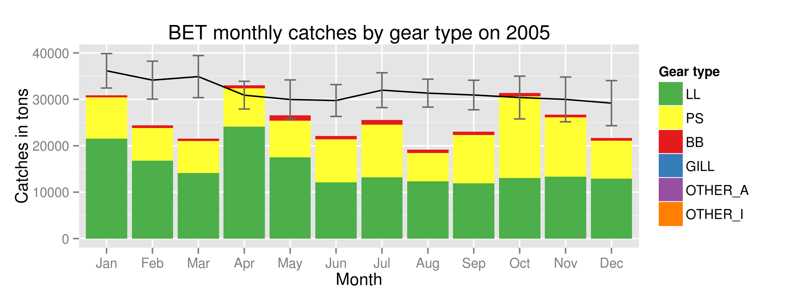

IRD / UMR EME Tuna Atlas: set of generic indicators for Fisheries datasets

---
# Indicators for Fisheries: use case of the Tuna Atlas

See documentation : https://github.com/jsubei/IRDTunaAtlas/wiki

## Tuna Atlas interactive maps and charts

This github page contains the code which:
 - extracts input data from the [Tuna Atlas](https://) developed jointly by IRD & FAO,
 - transforms input data to generates maps and plots: R functions or scripts,
 - packages maps and charts within either dynamic reports, shiny apps, jupyter notebooks...

Input data are obtained from a spatial data infrastructure currently hosted within a [Fisheries Atlas VRE](https://) of the Blue Cloud H2020 project.

## Analysis code

Key elements of the analysis code are a set of indicators originally drafted by Alain Fontenau which were written in R by Norbert Billet and Julien Barde during iMarine FP7 project:
- *[Indicator I1 : Annual catches by ocean](https://github.com/jsubei/IRDTunaAtlas/wiki/Indicator-I1-%3A-Annual-catches-by-ocean)* – an R script that extracts and reformats time-series stored within a Potgres/Postgis database. The output files are saved in the *outputs/www/html/tmp* folder.
- *[Indicator I2 : Annual catches by gear](https://github.com/jsubei/IRDTunaAtlas/wiki/Indicator-I2-:-Annual-catches-by-gear)*
- *[Indicator I3 : Catches by gear and by month](https://github.com/jsubei/IRDTunaAtlas/wiki/Indicator-I3-:-Catches-by-gear-and-by-month)*
- *[Indicator I4 : Catches by month and by ocean](https://github.com/jsubei/IRDTunaAtlas/wiki/Indicator-I4-:-Catches-by-month-and-by-ocean)*
- *[Indicator I6 : Catches by 5x5 degrees](https://github.com/jsubei/IRDTunaAtlas/wiki/Indicator-I6-:-Catches-by-5x5-degrees)*
- *[Indicator I7 : 5x5 degrees relative contribution to catches](https://github.com/jsubei/IRDTunaAtlas/wiki/Indicator-I7-:-5x5-degrees-relative-contribution-to-catches)*
- *[Indicator I8 : Catches relative contribution over other species](https://github.com/jsubei/IRDTunaAtlas/wiki/Indicator-I8-:-Catches-relative-contribution-over-other-species)*
- *[Indicator I9 : Size frequencies by school type](https://github.com/jsubei/IRDTunaAtlas/wiki/Indicator-I9-:-Size-frequencies-by-school-type)*
- *[Indicator I10 : Size frequencies by decade](https://github.com/jsubei/IRDTunaAtlas/wiki/Indicator-I10-:-Size-frequencies-by-decade)*
- *[Indicator I11 : Catches by country](https://github.com/jsubei/IRDTunaAtlas/wiki/Indicator-I11-:-Catches-by-country)*

An example of function outputs is provided below:

## Jupyer notebooks

Jupyer notebooks have been set up to help newcomers execute and customize the analysis code

These notebooks have been developped and executed in the [Fisheries Atlas VRE](https://) which contains a JupyerHub server. A screenshot of a Jupyer notebook is provided below.

## Shiny interface

These Shiny apps have been developped and executed in the [Fisheries Atlas VRE](https://) which contains a RStudio server and a shiny proxy server to host these apps.  A screenshot of the a Shiny app is provided below.

## Updates

The input data are expected to be updated on a yearly basis by FAO and IRD. This update is managed by a set of dedicated scripts:
 - IRD legacy code
 - IRD and FAO/FIRMS Tuna Atlas update to manage previous IRD workflow with geoflow package

## Other resources

Several resources proved invaluable when building this app, including:
- IRD original Tuna Atlas written by Alain Fonteneau [tutorial by Florianne Verkroost](https://www.documentation.ird.fr/hor/fdi:010012425) on building interactive maps;
- The [PDF atlas](https://horizon.documentation.ird.fr/exl-doc/pleins_textes/divers11-03/010012425.pdf) ;

## Authors
Julien Barde, Norbert Billet, Taha Imzilen, Paul Taconet, UMR MARBEC...

## Contact
julien.barde(at)ird.fr
